# bamazon
CAL Extension Coding Bootcamp- Bamazon Inventory

 ```
Welcome to Bamazon! This is an Amazon-like storefront built with MySQL and Node.js. 

Within the customer portal, you can view the inventory and choose an item you'd like to purchase
along with the quantity. However, if we do not have enough of the selected item in stock deeming 
us unable to fulfill your purchase, the transaction will not go through.

Within the manager portal, you can view all inventory in the store, view all low
inventory (less than 10 items in stock), choose to add to the inventory, and even add new items to your inventory! 


 ```

### Screenshots of Working App

Bamazon Customer
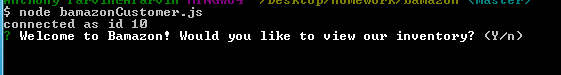;
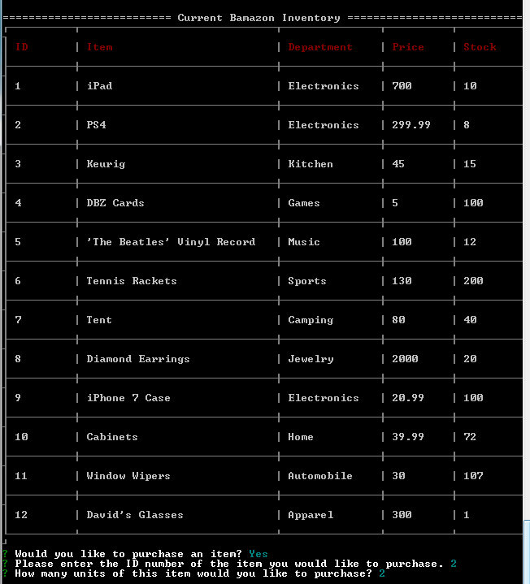;
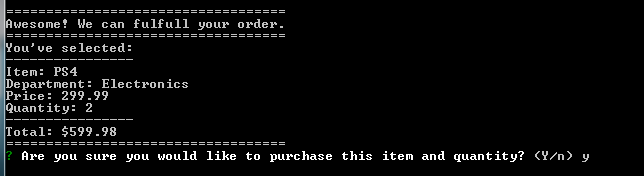;
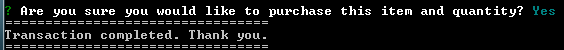;
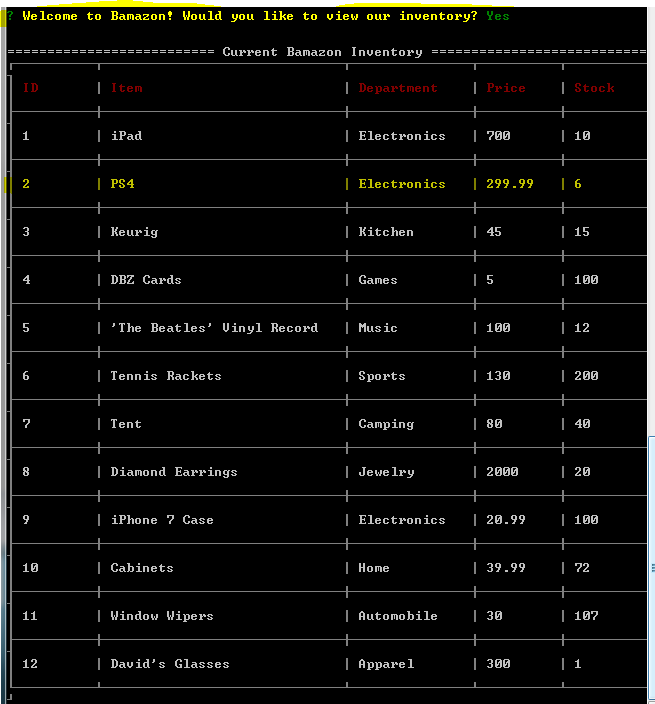;
;

Bamazon Manager
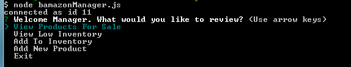;
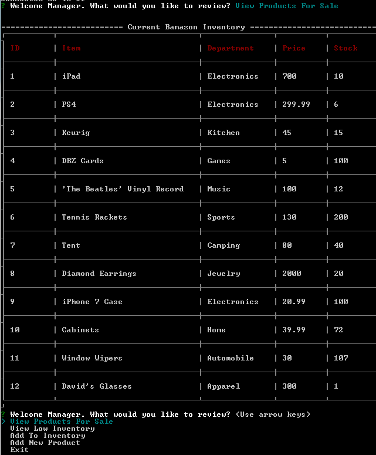;
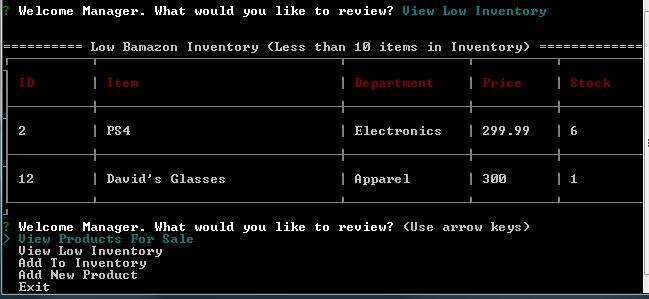;
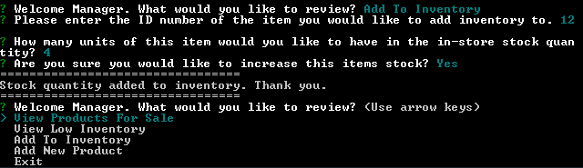;
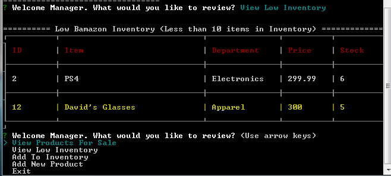;
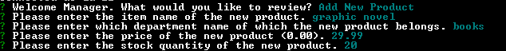;
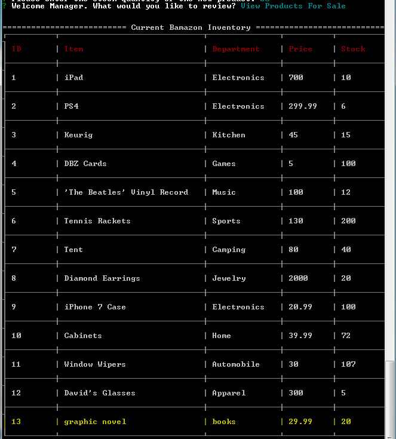;


### Getting Started

```
To get started on this project, follow the installations instructions below.
```


### Installations
``` Installing

Before you contribute

Make sure you install all the dependencies you need for the project
Once you have Node.js installed on your computer
Navigate to the working directory and do the following in your terminal

Before you proceed, make sure you fork the repo

###### Step 1
> npm install

The above command will install all the dependencies you need


###### Step 2
> Enter node bamazonCustomer in CLI to kickstart app


```


### Built With

```
* MySQL
* Node.JS
* JavaScript

```

### Contributing

```
There are different ways to contribute
* Back End
* Designers
* Unit Testers
* etc.
```

### Contributers

```
* Anthony Parvin
```


